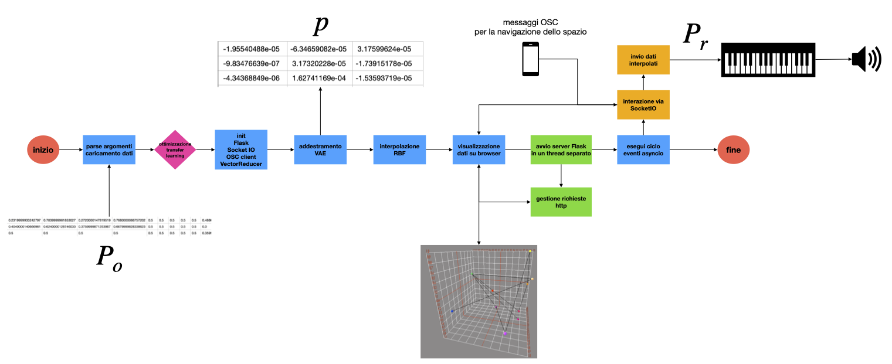

# WavePilot

Official implementation of *WavePilot: Framework multidimensionale per l'esplorazione dello spazio parametrico di strumenti digitali* by Alessandro Anatrini (XXIV CIM, 2024).

*WavePilot* is a framework designed to facilitate the exploration and manipulation of Digital Multimedia Instrument (DMmI) parameters. *WavePilot* employs a Variational Autoencoder (VAE) to translate the values of one or more DMmIs into a multidimensional (3D) representation of their parameter space. The primary goal is to enhance user interaction by offering a high-level graphical user interface (GUI) in the form of a navigable virtual space, simplifying DMmI programming.

WavePilot Operation Diagram: Blue for data processing, green for Flask server, orange for real-time communication with SocketIO, and magenta for decision-making (Anatrini, 2024).

## Introduction

WavePilot uses dimensionality reduction techniques for parameter space and nonlinear interpolation, enabling it to tackle multiple tasks simultaneously: exploring various DMmI configurations, automated macro-control learning, and interpolating between different instrument states defined as starting points. Essentially, programming a DMmI is reduced to a nonlinear mapping problem within a multidimensional virtual space.
The tool uses the DAW REAPER as a host for the audio plugins it applies. However, its versatility allows it to be used in any environment with OSC support that can host plugins or integrate them natively, such as TouchDesigner, Max, or any standalone FAUST app.

## Requirements

To install and run this repository, you will need to set up a virtual environment using Conda.

### Create a virtual environment

Be sure to have conda installed on your machine and create a new Conda virtual environment using the `environment.yml` file provided in the repository. This file contains all the dependencies required for the project:

    `conda env create -f environment.yml`

Activate the newly created virtual environment named "wp":

    `conda activate wp`

### Install REAPER

REAPER is required to host the plugin and reder its presets values. You can download and install REAPER from the [official website](https://www.reaper.fm/download.php).

### Install Max

You need Max (version 8 or later), which can be run in runtime mode if you do not have a full license. Download it from the [official Max website](https://cycling74.com/downloads). Install also the `odot` library for Max, which can be downloaded and installed via Max's package manager. This library is essential for OSC communication.

### Install Blackhole

In addition to the dependencies listed in environment.yml and REAPER, ensure that Blackhole is installed. Blackhole is a crucial component for sending and receiving audio from the REAPER hosting the plugin:

    `brew install blackhole`

### System Compatibility

Please note that this code has been tested only on macOS. Compatibility with other operating systems is not guaranteed.
 

## Dataset and Configuration for *WavePilot*

To use *WavePilot*, you need at least one dataset representing a collection of presets in `.csv` format. REAPER is used as the plugin host due to its advanced scripting capabilities. This setup enables you to load one or more plugins, receive OSC messages to set parameters, and save those parameter values to a dataset.

### Preparing Presets

When working on a single audio plugin, you can use presets in three ways:

1. **User-defined Presets**: Manually create and save presets within the plugin. You can then export these presets to a `.csv` file using the `plugin_renderer.py` script:

    `python plugin_renderer.py -m preset -d <blackhole_device_id>`

2. **Factory Presets**: You can also export the factory presets already available in the plugin using the same script.

3. **Random Presets**: If there are no user or factory presets, generate random presets with:

`python plugin_render.py -m random -d <blackhole_device_id> -t <silence_threshold>`

Here, `-t` specifies the amplitude threshold below which presets are considered silent and excluded from the dataset. The default value is 1e-6. Use `plugin_render.py -h` to see all options for dataset generation and saving.

We recommend starting with at least 10 presets, although *WavePilot* can operate with fewer. The dataset defines the exploration space arbitrarily set by the user, and having more presets can improve results.

### Transfer Learning for Enhanced Performance

For improved accuracy in reconstructing preset values from the latent space, consider using transfer learning. This involves working with two datasets: your initial dataset and a larger one containing as many presets as possible from the plugin.
To find the optimal hyperparameters for the VAE’s low-dimensional representation and the Radial Basis Function interpolator, run a grid search:

    `python optim_grid.py -f <filepath_small_dataset> -F <filepath_large_dataset> -s <filepath_pretrained_model>`

* `-F`: Path to the larger dataset for pretraining;
* `-s`: Path to store the pre-trained model.

When using transfer learning (i.e., providing both `-F` and `-s`), this script will save a model based on the larger dataset, which will then be used during training to fine-tune the reconstruction of values from the latent space. If transfer learning is not used, you only need to provide the smaller dataset with `-f`. The best hyperparameter combination will be saved in a log file inside the `logs` folder.

### Training and Visualising the Model

With the `.log` file containing the best hyperparameter combinations for the VAE and the interpolator, you can now train the model and visualize the representation of presets as points in a three-dimensional space:

    `python train.py -f <filepath_small_dataset> -m <filepath_pretrained_model> -o <filepath_to_optimization_log>`

* `-m`: Path to the pre-trained model (omit this if not using transfer learning);
* `-o`: Path to the optimization `.log` file (omit this if you did not run the optimization routine);
* `-h`: Show options for the manual configuration of hyperparameters.

Once the model is trained, you can view the three-dimensional representation of the dataset by opening the following address in a browser: `http://127.0.0.1:5000`.

You can navigate the 3D representation by moving the cursor. To control the cursor and receive parameter values, open the Max patch `wavepilot_controller.maxpat` which offers two options:

1. **Predefined Trajectories**: Select from a menu of predefined trajctories. For this option you need the free available [Spat](https://forum.ircam.fr/projects/detail/spat/) library installed on Max;

2. **Smart Device Control**: Use a smart device to control the cursor `SMARTD`. You can choose between using a combination of gyroscope and accelerometer data or x,y screen coordinates with pressure sensitivity, if your device supports it. To control the cursor from a smart device, install the free app [ZIG SIM](https://apps.apple.com/de/app/zig-sim/id1112909974) and configure the settings with the IP address of the machine running the model, port number 8888, and message format set to OSC.

Simultaneously, open REAPER with the plugin to which *WavePilot* is applied and in a new terminal window run:

    `python plugin_setter.py`

This will send the parameter values generated by the cursor movement to the plugin in REAPER via OSC port 5106.
When the cursor is exactly on one of the points within the virtual space, it will return the values of each parameter associated with that preset with very low reconstruction error. When the cursor is at a point in the virtual space not containing presets, it will return interpolated values consistent with the existing presets in the space by interpolating between all points (i.e., the presets in the space).