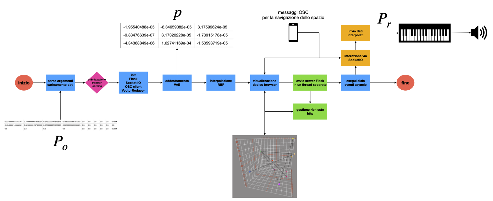

# WavePilot

Official implementation of *WavePilot: Framework multidimensionale per l'esplorazione dello spazio parametrico di strumenti digitali* by Alessandro Anatrini (XXIV CIM, 2024).

*WavePilot* is a framework designed to facilitate the exploration and manipulation of Digital Multimedia Instrument (DMmI) parameters. *WavePilot* employs a Variational Autoencoder (VAE) to translate the values of one or more DMmIs into a multidimensional (3D) representation of their parameter space. The primary goal is to enhance user interaction by offering a high-level graphical user interface (GUI) in the form of a navigable virtual space, simplifying DMmI programming.


*WavePilot Operation Diagram* (Anatrini, 2024).


## Introduction

WavePilot uses dimensionality reduction techniques for parameter space and nonlinear interpolation, enabling it to tackle multiple tasks simultaneously: exploring various DMmI configurations, automated macro-control learning, and interpolating between different instrument states defined as starting points. Essentially, programming a DMmI is reduced to a nonlinear mapping problem within a multidimensional virtual space.

The tool uses the DAW REAPER as a host for the audio plugins it applies. However, its versatility allows it to be used in any environment with OSC support that can host plugins or integrate them natively, such as TouchDesigner, Max, or any standalone FAUST app.

> **Branch note — `experimental-osc`**: this branch replaces the legacy Max controller and `plugin_setter.py` workflow with a unified Python OSC pipeline. Dataset rendering and device control are exposed through the single entrypoint `plugin_main.py`. OSC ports and target hosts are fully configurable at the CLI level.


## Requirements

### Create a virtual environment

Be sure to have conda installed on your machine and create a new Conda virtual environment using the `environment.yml` file provided in the repository:

```bash
conda env create -f environment.yml
conda activate wp
```

### Install REAPER

REAPER is required to host the plugin and render its preset values. Download it from the [official website](https://www.reaper.fm/download.php).

### Install Blackhole

Blackhole is required for audio routing between REAPER and the recording subsystem:

```bash
brew install blackhole
```

### System Compatibility

This code has been tested on macOS only. Compatibility with other operating systems is not guaranteed.


## OSC Architecture

This branch uses a **three-port OSC system**:

```
Smart device / software
        │
        │  OSC (any format)
        ▼
RECEIVE_PORT 9900  ←── plugin_main.py controller
        │
        │  /cursor [x y z]
        ▼
FORWARD_PORT 9901  ←── visualizer.py  (OSC → Socket.IO → browser)
                                │
                                │  cursor_move (Socket.IO)
                                ▼
                       socket_handlers.py
                                │
                                │  per-parameter OSC messages
                                ▼
                    SEND_PORT 9902  →  REAPER / ReaLearn
```

Constants are defined in `constants.py`:

| Constant | Default | Role |
|---|---|---|
| `RECEIVE_PORT` | 9900 | Receives OSC from controller/device |
| `FORWARD_PORT` | 9901 | Visualizer receives `/cursor [x y z]` |
| `SEND_PORT` | 9902 | Sends parameter values to REAPER |
| `WEBAPP_PORT` | 5000 | Flask + Socket.IO web interface |


## OSC Address Files

Each plugin requires a JSON address file stored in the `addresses/` folder. This file maps parameter names (or indices) to ReaLearn OSC paths. Examples already included:

- `addresses/obxd.json` — OB-Xd plugin
- `addresses/adaptiverb.json` — Adaptiverb plugin

Pass the path of the relevant file to `plugin_main.py controller` via the `-f` flag.


## Dataset Generation

REAPER must be running with the target plugin loaded before executing any render command.

The unified entrypoint for rendering is `plugin_main.py render`.

### Export factory/user presets

```bash
python plugin_main.py render -m preset -d <blackhole_device_id> -o <output_dataset_name>
```

### Generate random presets with silence filtering

```bash
python plugin_main.py render -m random -d <blackhole_device_id> -o <output_dataset_name> -t <silence_threshold> -n <num_iterations>
```

### All render options

| Flag | Description | Default |
|---|---|---|
| `-m`, `--mode` | `preset` or `random` | `preset` |
| `-d`, `--device` | Blackhole audio device ID | interactive prompt |
| `-o`, `--output` | Output CSV filename (saved to `data/`) | required |
| `-t`, `--threshold` | Silence detection threshold (energy-based) | `0.001` |
| `-n`, `--num-iterations` | Number of random presets (random mode only) | `100` |
| `--plugin-dir` | Subfolder for rendered audio under `audio/` | `default_plugin` |
| `--osc-host` | OSC target host for REAPER | `127.0.0.1` |
| `--osc-port` | OSC target port for REAPER | `9902` |

Datasets are saved as CSV files to the `data/` folder. Rendered audio is saved to `audio/<plugin-dir>/`.

We recommend starting with at least 10 presets.


## Hyperparameter Optimization

Run the unified optimizer (VAE + RBF, two-stage Optuna search):

```bash
python main.py optimize -f <dataset.csv>
```

### Options

| Flag | Description |
|---|---|
| `-f`, `--filepath` | Path to the dataset CSV (required) |
| `-n`, `--num_entries` | Number of random entries to subsample from the dataset |
| `-m`, `--mask_columns` | Space-separated list of parameter names to exclude |

The best hyperparameter combination is saved in a timestamped `.log` file inside the `logs/` folder.


## Training and Visualization

Train the VAE and build the RBF interpolator, then launch the web interface:

```bash
python main.py train -f <dataset.csv> -o <optimizer_log.log>
```

### Options

| Flag | Description |
|---|---|
| `-f`, `--filepath` | Path to the dataset CSV (required) |
| `-o`, `--optimizer-session` | Path to an optimization `.log` file (optional) |
| `-p`, `--pretrained-model` | Path to a pretrained `.pt` checkpoint (optional) |
| `-s`, `--save-model-path` | Save the trained model to this path after training |
| `--osc-host` | OSC target host for REAPER (default: `127.0.0.1`) |
| `--osc-port` | OSC target port for REAPER (default: `9902`) |

Once training is complete, open the 3D preset representation in a browser:

```
http://127.0.0.1:5000
```

The browser UI visualises preset anchor points as interactive 3D coordinates and updates in real time as the cursor moves. When the cursor sits exactly on a preset point, parameter values are reconstructed with very low error. At any other position, values are interpolated consistently across the space.


## OSC Controller

In a separate terminal, start the async OSC controller to bridge your input device to the WavePilot pipeline:

```bash
python plugin_main.py controller -f <addresses/plugin.json>
```

The controller listens on `RECEIVE_PORT` (9900) and forwards processed `/cursor [x y z]` messages to `FORWARD_PORT` (9901) where the visualizer picks them up.

### Controller options

| Flag | Description | Default |
|---|---|---|
| `-f`, `--filepath` | Path to the OSC address JSON file (required) | — |
| `-i`, `--ingest` | Input processing mode: `none`, `touch`, `imu`, `orientation` | `none` |
| `--osc-host` | Forward target host | `127.0.0.1` |
| `--osc-port` | Forward target port | `9901` |

### Ingestion modes

- **`none`**: raw OSC pass-through, no transformation applied
- **`touch`**: maps touch screen coordinates and radius (from ZIG SIM) to `[x, y, z]`
- **`imu`**: IMU-based mapping (placeholder, pending implementation)
- **`orientation`**: orientation-based mapping (placeholder, pending implementation)

### ZIG SIM (smart device control)

To control the cursor from a smartphone, install the free app [ZIG SIM](https://apps.apple.com/de/app/zig-sim/id1112909974) and configure it with:

- **IP**: address of the machine running WavePilot
- **Port**: `9900`
- **Message format**: OSC

Then run the controller with `-i touch`.


## Complete Workflow

The standard session requires three terminal windows running simultaneously:

**Terminal 1 — Train and start the web server:**
```bash
python main.py train -f data/<dataset.csv> -o logs/<optimizer.log>
```

**Terminal 2 — Start the OSC controller:**
```bash
python plugin_main.py controller -f addresses/<plugin.json> -i <mode>
```

**Terminal 3** — Open REAPER with the plugin loaded and ReaLearn configured to listen on port `9902`.

Navigate to `http://127.0.0.1:5000` to view the preset space.


## File Structure

| Path | Description |
|---|---|
| `data/*.csv` | Preset datasets (normalized [0, 1] parameter values) |
| `audio/<plugin>/` | Rendered WAV files |
| `checkpoints/*.pt` | Saved model checkpoints (VAE, RBF, scaler) |
| `logs/*.log` | Optimization session logs |
| `addresses/*.json` | Per-plugin OSC address maps |
| `reaper/` | Example REAPER project files |


## REAPER Project Files

- `reaper/WP-OBXd-Tester.RPP`: example project for the OB-Xd plugin
- `reaper/WP-Adaptiverb-Tester.RPP`: example project for the Adaptiverb plugin

Load these in REAPER to test the full preset rendering and parameter control workflow.
